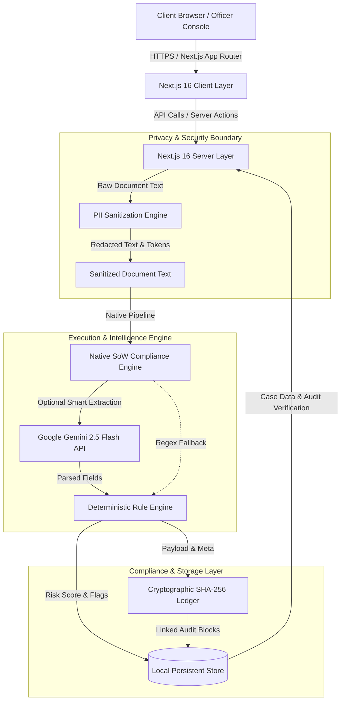
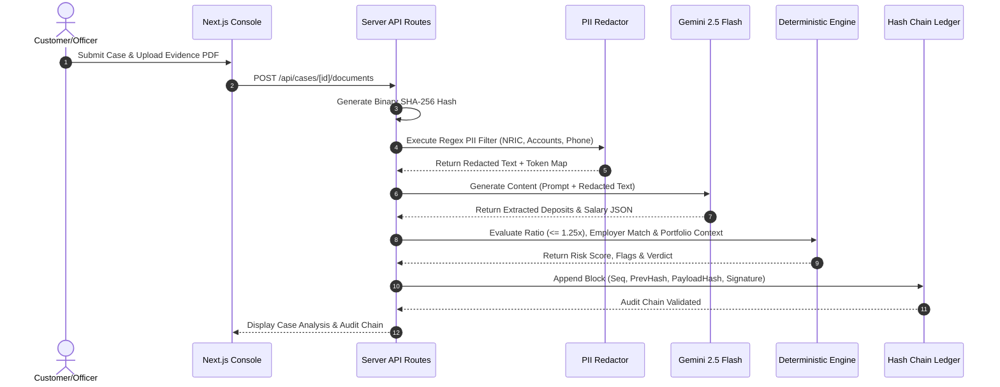
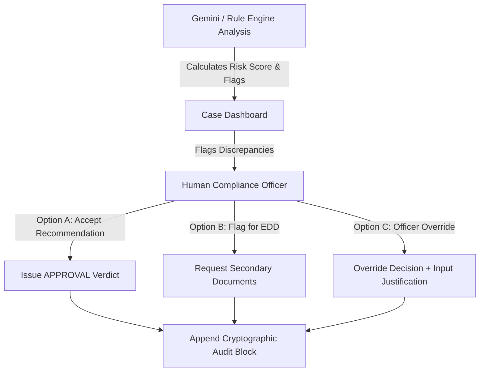
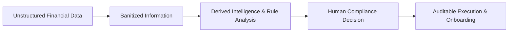

<p align="center">
  
</p>

# LUXERA PROVENANCE

### Financial Evidence & Compliance Intelligence Infrastructure

**Open-source Source of Wealth (SoW) compliance infrastructure for portfolio-linked client intelligence, financial evidence verification, and compliance operations.**

---

[](#-language--bahasa)
[](LICENSE)
[](https://nextjs.org)
[](https://www.typescriptlang.org)
[](https://ai.google.dev)
[](https://www.pdp.gov.my)
[]()

---

## 🌐 Language / Bahasa

- 🇬🇧 [**English Documentation (README.md)**](README.md)
- 🇲🇾 [**Dokumentasi Bahasa Melayu (README.ms.md)**](README.ms.md)

---

## 📋 Table of Contents

1. [Project Overview](#-project-overview)
2. [Core Philosophy](#-core-philosophy)
3. [About Luxera Cognitive Resources](#-about-luxera-cognitive-resources)
4. [Leadership & Founders](#-leadership--founders)
5. [Why Provenance Exists](#-why-provenance-exists)
6. [Core Capabilities](#-core-capabilities)
7. [End-to-End Workflow](#-end-to-end-workflow)
8. [System Architecture](#-system-architecture)
9. [Data Flow Pipeline](#-data-flow-pipeline)
10. [Deterministic vs AI Decision Layers](#-deterministic-vs-ai-decision-layers)
11. [Security Architecture](#-security-architecture)
12. [Privacy & PDPA Act 709 Compliance](#-privacy--pdpa-act-709-compliance)
13. [AI & Gemini Multimodal Architecture](#-ai--gemini-multimodal-architecture)
14. [Cryptographic SHA-256 Audit Ledger](#-cryptographic-sha-256-audit-ledger)
15. [Human-in-the-Loop Review Engine](#-human-in-the-loop-review-engine)
16. [Technology Stack](#-technology-stack)
17. [Project Structure](#-project-structure)
18. [API Documentation](#-api-documentation)
19. [Environment Configuration](#-environment-configuration)
20. [Local Development & Setup](#-local-development--setup)
21. [Design System & Typography](#-design-system--typography)
22. [Product Ecosystem](#-product-ecosystem)
23. [Luxera Intelligence Philosophy](#-luxera-intelligence-philosophy)
24. [Product Roadmap](#-product-roadmap)
25. [Open Source & Licensing](#-open-source--licensing)
26. [Contributing Guidelines](#-contributing-guidelines)
27. [Responsible AI & Security Disclosure](#-responsible-ai--security-disclosure)
28. [Disclaimer](#-disclaimer)
29. [Corporate Contact](#-corporate-contact)

---

## 🏛️ Project Overview

**Luxera Provenance** is an enterprise-grade, open-source Source of Wealth (SoW) compliance and financial evidence verification infrastructure. Built specifically for fintech platforms, Islamic wealth managers, digital banks, and financial compliance teams, Provenance transforms unstructured financial evidence—such as bank statements, salary payslips, tax filings, real estate sale deeds, and employment verification letters—into structured, audit-ready compliance intelligence.

### Key Technical & Product Highlights
- **Pre-LLM PII Sanitization Engine**: Automatic, deterministic masking of sensitive personal identifiers (Malaysian NRIC, passport numbers, bank account/credit card numbers, email addresses, and phone numbers) before data is processed by AI models, adhering strictly to Malaysia's Personal Data Protection Act 2010 (PDPA Act 709 Section 9).
- **Deterministic Financial Consistency Rules**: Rule-based validation enforcing mathematical thresholds—including 12-month deposit-to-annual-salary ratios (threshold $\le 1.25\times$), employer name fuzzy matching, and document freshness checks—preventing hallucinated or ambiguous AI decisions.
- **Multimodal OCR & Document Extraction**: Server-side document processing powered by Google Gemini 2.5 Flash via `@google/genai` TypeScript SDK, with a deterministic fallback path when AI credentials are unavailable.
- **SHA-256 Cryptographic Hash Chained Audit Ledger**: Tamper-evident ledger linking every case creation, document ingestion, rule evaluation, and human compliance officer override into a verifiable, mathematically linked hash chain.
- **Human-in-the-Loop (HITL) Decisioning**: A dedicated compliance officer console enabling manual review, risk point evaluation, override justifications, and statutory consent tracking. AI assists and synthesizes findings; human authority makes the ultimate compliance determination.

---

## 💡 Core Philosophy

Luxera Provenance is built around six foundational operational principles:

1. **Evidence Primacy**: Compliance decisions must be derived directly from verified primary evidence, never assumptions or unverified self-declarations.
2. **Deterministic Boundaries**: Critical financial rules (such as variance thresholds and mathematical limits) must be enforced deterministically, not delegated to probabilistic language models.
3. **Privacy by Design**: Personal Data Identifiers (PII) must be sanitized prior to model evaluation to prevent data leakage and preserve data subject sovereignty under local privacy laws.
4. **Verifiable Auditability**: Every compliance action, data transformation, and decision override must produce a cryptographically chained, immutable audit record.
5. **Human Sovereignty**: AI models serve strictly as cognitive assistants to compliance officers. Final legal authority and accountability reside solely with human compliance officers.
6. **Intelligence Infrastructure**: Compliance is not merely a cost-center checklist—it is operational intelligence that builds institutional trust and accelerates onboarding velocity.

---

## 🏢 About Luxera Cognitive Resources

**Luxera Cognitive Resources** is a Malaysian technology firm pioneering **Intelligence Infrastructure for the Decision Economy**. Luxera designs and deploys specialized software platforms that transform fragmented business activity into operational clarity, automated decisioning, and seamless customer experiences.

| Attribute | Details |
| :--- | :--- |
| **Legal Name** | Luxera Cognitive Resources |
| **Registration No.** | 003808430-T |
| **Corporate Website** | [https://www.luxera.world](https://www.luxera.world) |
| **Headquarters** | Kuala Selangor, Selangor, Malaysia |
| **General Email** | [contact@luxera.world](mailto:contact@luxera.world) |
| **Business Contact** | +60 17-734 8015 |
| **Core Positioning** | *Intelligence Infrastructure for the Decision Economy* |

---

## 👥 Leadership & Founders

### Founder & Systems Architect
**Khairulanuar Khaidir**  
*Founder & Systems Architect, Luxera Cognitive Resources*

Khairulanuar leads system architecture, intelligence infrastructure design, and AI automation engineering across the Luxera product ecosystem. His focus encompasses revenue intelligence, enterprise AI orchestration, deterministic compliance systems, and production-ready business software.
- **Email**: [khai@luxera.world](mailto:khai@luxera.world)
- **LinkedIn**: [https://www.linkedin.com/in/khairulanuar-khaidir](https://www.linkedin.com/in/khairulanuar-khaidir)

### Co-Founder & Business Strategist
**Nur Adibah Tahir**  
*Co-Founder & Business Strategist, Luxera Cognitive Resources*

Nur Adibah oversees commercial operations, strategic industry partnerships, market development, and institutional client relations across domestic and regional compliance operations.
- **Email**: [adibah@luxera.world](mailto:adibah@luxera.world)

---

## 🎯 Why Provenance Exists

Financial institutions and wealth managers face severe operational friction when verifying Source of Wealth (SoW) for High-Net-Worth Individuals (HNWIs) and retail wealth management clients:

```
[Fragmented Documents]      [Manual Overhead]        [Compliance Risk]
  - Bank Statements          - Manual Line Checking   - PII Leakage
  - Payslips & EPF           - Unchecked Variances    - Unverifiable Audits
  - Tax Declarations   --->  - Paper Discrepancies -> - Regulatory Fines
  - Sale Deeds               - Slow Customer SLA      - Inconsistent Rules
```

1. **Fragmented Unstructured Evidence**: Evidence arrives in inconsistent PDF and image formats, requiring time-consuming manual review by compliance analysts.
2. **PII and Data Sovereignty Exposure**: Forwarding raw customer financial documents directly to cloud AI models exposes sensitive personal identifiers, breaching PDPA 2010 (Act 709) and regional banking secrecy regulations.
3. **Lack of Immutable Audit Trails**: Traditional spreadsheet or ticket-based review processes leave compliance teams vulnerable during regulatory audits under AMLA 2001 (Act 613).
4. **Black-Box AI Risks**: Generic AI solutions lack deterministic rule boundaries, leading to unpredictable compliance verdicts or false approvals.

**Luxera Provenance solves this by introducing a structured, privacy-preserving, deterministic evidence pipeline backed by cryptographic audit integrity.**

---

## ✨ Core Capabilities

- 📄 **Drag & Drop Multi-Format Evidence Ingestion**: Supports client-side PDF and image upload with instant MIME-type validation, size limits, and local SHA-256 binary fingerprinting.
- 🔒 **Pre-LLM PII Sanitization (PDPA Act 709)**: Real-time regex pattern masking for Malaysian NRIC (`YYMMDD-PB-###G`), Passport numbers, Bank Account/Credit Card numbers (10–16 digits), Email addresses, and Malaysian phone numbers (`+601x`).
- 🤖 **Multimodal Gemini Vision Extraction**: Extracts structured financial profiles—including monthly net salary, 12-month total deposits, employer names, and currency codes—using `@google/genai` TypeScript SDK with `gemini-2.5-flash`.
- ⚙️ **Deterministic Financial Consistency Engine**: Automated execution of hard compliance rules:
  - Deposit-to-Salary Ratio Evaluation ($\le 1.25\times$ threshold).
  - Employer Name Consistency Verification (Fuzzy matching declared vs extracted employer).
  - Document Freshness & Completeness Scoring.
- 🔗 **SHA-256 Cryptographic Hash Chained Audit Trail**: Every case operation generates a linked audit block containing `sequence_id`, `previous_block_hash`, `payload_hash`, timestamp, actor email, and `block_hash`. Includes real-time mathematical integrity verification.
- 🛡️ **Human-in-the-Loop (HITL) Officer Console**: Interactive UI for compliance officers to review risk flags, inspect redacted vs raw evidence text, input override justifications, and issue binding compliance verdicts (`APPROVED`, `MANUAL_REVIEW_REQUIRED`, `REJECTED`).
- 📑 **Data Subject Access Request (DSAR) Engine**: Instant generation of structured JSON compliance dossiers adhering to Section 12 of PDPA Act 709.
- ⚡ **Native SoW Verification Engine**: Built-in compliance execution system that runs the Source of Wealth workflow natively within application code, combining local deterministic verification with optional server-side Gemini AI analysis.

### Portfolio & Client Intelligence

The application supports a portfolio-linked client intelligence flow alongside standalone SoW intake:

- **Portfolio Import**: Client records can be imported, validated, searched, and reviewed in the Portfolio console.
- **Case Linkage**: A portfolio client can be linked directly into a new SoW case so the case carries portfolio context from intake.
- **Portfolio Snapshot**: The case record preserves the client snapshot, deposited amount, currency, and last case linkage for downstream review.
- **Financial Consistency Context**: Portfolio exposure is evaluated as contextual financial evidence together with declared income, bank statements, payslips, and the existing deterministic rules.
- **Status Synchronization**: Portfolio client status updates when linked SoW cases are created and processed.

Portfolio exposure is contextual financial information. It must not be treated as an automatic AML violation by itself; the system evaluates portfolio exposure together with declared income, bank evidence, payslip evidence, and deterministic rules.

---

## 🔄 End-to-End Workflow

```
┌─────────────────────────────────────────────────────────────────────────┐
│                        COMPLIANCE CASE WORKFLOW                         │
└─────────────────────────────────────────────────────────────────────────┘
                                   │
                                   ▼
                       [ 1. Case Creation ]
             Customer details, declared income & source
                                   │
                                   ▼
                     [ 2. Statutory Consent ]
          PDPA Act 709 Notice & Consent receipt recorded
                                   │
                                   ▼
                     [ 3. Evidence Upload ]
             PDF / Image ingestion & SHA-256 hashing
                                   │
                                   ▼
                   [ 4. Pre-LLM PII Sanitization ]
        Masks NRIC, accounts, emails, phones prior to AI
                                   │
                                   ▼
                 [ 5. Gemini Vision OCR Extraction ]
           Structured extraction of deposits & salary
                                   │
                                   ▼
               [ 6. Deterministic Rule Evaluation ]
        Ratio check (<= 1.25x), employer match, risk points
                                   │
                                   ▼
                 [ 7. SHA-256 Audit Block Chaining ]
         Block appended with previous hash & payload hash
                                   │
                                   ▼
                 [ 8. Human Compliance Officer HITL ]
             Officer reviews flags & submits final decision
                                   │
                                   ▼
                   [ 9. Final Case Verdict & DSAR ]
          Immutable decision state & compliance dossier export
```

### Case Intake Modes

#### Portfolio Mode

Portfolio-linked cases are created when a customer is already present in the Portfolio console and a SoW case is opened from that client profile.

1. Portfolio client is selected or imported.
2. SoW case is created with portfolio snapshot data attached.
3. Bank statement and payslip evidence are uploaded and processed.
4. Portfolio Financial Consistency is evaluated together with the existing deterministic SoW rules.
5. Risk score, rule outcomes, and final decision are generated.
6. Portfolio client status is updated after case processing.

#### Standalone Mode

Standalone SoW cases are created directly from the New SoW Case screen with no portfolio client attached.

1. No portfolio client is linked to the case.
2. No portfolio exposure is attached to the intake payload.
3. The Portfolio Financial Consistency rule is not activated.
4. Existing deterministic SoW evaluation continues unchanged.
5. Risk score and final decision are generated from the submitted evidence only.

Portfolio exposure is contextual financial information, not an automatic AML violation. The engine considers exposure, declared income, bank evidence, payslip evidence, and deterministic rules together.

---

## 📐 System Architecture



---

## 🔀 Data Flow Pipeline



---

## ⚖️ Deterministic vs AI Decision Layers

Luxera Provenance strictly isolates deterministic calculations from AI reasoning to ensure compliance predictability:

| Processing Layer | Responsibility | Layer Type | Operational Guarantee |
| :--- | :--- | :--- | :--- |
| **File Fingerprinting** | Computes SHA-256 hash of binary uploads | **Deterministic** | $100\%$ cryptographic repeatability |
| **PII Sanitization** | Regex pattern masking of NRIC, Bank Acc, Email | **Deterministic** | Zero PII transmitted to AI models |
| **Document OCR / Extraction** | Parses text & extracts structured financial figures | **AI (Gemini Flash)** | Multimodal reasoning with confidence scores |
| **Income-Deposit Ratio Check** | Calculates $\frac{\text{12M Bank Deposits}}{\text{Declared Annual Income}}$ | **Deterministic** | Strict mathematical threshold ($\le 1.25\times$) |
| **Employer Name Match** | Fuzzy matching of document vs declared employer | **Deterministic** | Exact or substring match validation |
| **Compliance Flag Assignment** | Assigns risk points & recommended remediation | **Deterministic** | Standardized risk scoring rules (0–100) |
| **Compliance Synthesis** | Summarizes findings & risk narrative for officer | **AI (Gemini Flash)** | Natural language executive summary |
| **Final Case Verdict** | Issues binding decision (`APPROVED` / `REJECTED`) | **Human (HITL)** | Human compliance officer accountability |
| **Audit Block Chaining** | Links decision event into SHA-256 hash chain | **Deterministic** | Cryptographic tamper evidence |

---

## 🛡️ Security Architecture

Luxera Provenance enforces multiple security controls:

1. **Server-Side API Key Protection**: The `GEMINI_API_KEY` is maintained exclusively within server-side environments (`process.env.GEMINI_API_KEY`). It is never exposed to client bundles (`NEXT_PUBLIC_`).
2. **Binary Content Validation**: Uploaded documents are checked for MIME type integrity (`application/pdf`, `image/png`, `image/jpeg`, `image/jpg`, `image/pjpeg`), size constraints (max 25MB per document), and SHA-256 file hashing.
3. **Pre-LLM Data Masking**: All OCR text passes through local PII redaction filters before payload construction, eliminating the risk of third-party model data retention.
4. **Tamper-Evident Hash Chain**: Audit events are cryptographically bound to the previous block's SHA-256 hash. Any modification to historic audit payloads invalidates the chain signature.

---

## 📜 Privacy & PDPA Act 709 Compliance

Luxera Provenance is engineered to comply with the **Malaysia Personal Data Protection Act 2010 (PDPA Act 709)** and related regulatory guidelines:

- **Section 6 (General Principle)**: Statutory consent is recorded via a dedicated consent ledger tracking user ID, organization ID, purpose, policy version, client IP address, and user-agent string.
- **Section 9 (Security Principle)**: PII redaction masks sensitive data identifiers before processing or external transmission.
- **Section 12 (Data Subject Access Request - DSAR)**: Provides automated API endpoints (`GET /api/compliance/dsar?case_id=...`) to export complete, structured JSON compliance dossiers for data subjects upon request.
- **Cross-Border Transfer Alignment**: By performing local PII sanitization server-side prior to model evaluation, cross-border data transfer risks are mitigated in accordance with PDP regulations.

> *Note: Technical software controls support PDPA compliance workflows but do not constitute independent legal certification. Organizations must ensure overall operational compliance.*

---

## 🤖 AI & Gemini Multimodal Architecture

Luxera Provenance utilizes the **Google Gemini 2.5 Flash** model via the official `@google/genai` TypeScript SDK (`GoogleGenAI` class) for server-side document extraction and compliance narrative synthesis, with deterministic fallback logic when AI execution is unavailable.

### AI Processing Steps:
1. **Multimodal Document Parsing**: Passes document OCR text and metadata into Gemini Flash.
2. **Structured Extraction**: Extracts verified monthly income, verified annual income, total 12-month bank deposits, detected employer name, and extraction confidence score.
3. **Structured Explanation**: Synthesizes a 2–3 paragraph compliance narrative highlighting income sources, deposit variances, and recommended EDD steps.

```typescript
// Server-Side Gemini API Route Pattern
import { GoogleGenAI } from '@google/genai';

const ai = new GoogleGenAI({ apiKey: process.env.GEMINI_API_KEY });

const response = await ai.models.generateContent({
  model: 'gemini-2.5-flash',
  contents: prompt,
});
```

---

## 🔗 Cryptographic SHA-256 Audit Ledger

Every event in Luxera Provenance is appended to an internal **SHA-256 Cryptographic Hash-Chained Audit Ledger**.

```mermaid
graph LR
    subgraph Genesis Block
        B1[Block #1<br/>Seq: 1<br/>PrevHash: GENESIS...<br/>Payload: CASE_CREATED]
    end

    subgraph Evaluation Block
        B2[Block #2<br/>Seq: 2<br/>PrevHash: Hash(B1)<br/>Payload: SOW_EVALUATED]
    end

    subgraph Officer Block
        B3[Block #3<br/>Seq: 3<br/>PrevHash: Hash(B2)<br/>Payload: OFFICER_OVERRIDE]
    end

    B1 -->|Hash Linked| B2
    B2 -->|Hash Linked| B3
```

### Mathematical Hash Formula
For any given block $N$:
$$\text{BlockHash}_N = \text{SHA256}\Big(\text{Seq}_N \;\parallel\; \text{PrevHash}_{N-1} \;\parallel\; \text{CaseID} \;\parallel\; \text{EventType} \;\parallel\; \text{ActorID} \;\parallel\; \text{Timestamp} \;\parallel\; \text{PayloadHash}_N\Big)$$

The system provides an automated verification endpoint (`GET /api/compliance/verify-audit-chain`) that iteratively recomputes all block signatures and verifies chain continuity.

---

## 👤 Human-in-the-Loop Review Engine

AI models in Luxera Provenance never execute autonomous binding decisions without human oversight.



Compliance officers can inspect raw vs redacted document text, review specific rule failures, and log override reasons into the hash-chained audit ledger.

---

## 🛠️ Technology Stack

| Component | Technology | Version / Specification |
| :--- | :--- | :--- |
| **Framework** | Next.js (App Router) | `16.3.1` |
| **UI Runtime** | React | `19.2.0` |
| **Language** | TypeScript | `5.9.3` |
| **Styling** | Tailwind CSS | `4.1.11` |
| **Animations** | Motion | `12.23.24` |
| **Icons** | Lucide React | `0.553.0` |
| **AI SDK** | `@google/genai` | `^2.4.0` (Gemini 2.5 Flash) |
| **Storage** | Local persistent JSON store | Cases, portfolio clients, documents, and audit blocks |
| **Workflow Engine** | Native Compliance Engine | Native evaluation & threshold logic |
| **Cryptography** | Node.js `crypto` | Native SHA-256 Implementation |
| **Containerization** | Docker / Docker Compose | Production Container Setup |

---

## 📁 Project Structure

```
luxera-provenance/
├── .DOCS/                     # Statutory compliance reference materials & legal docs
├── app/                       # Next.js 15 App Router directory
│   ├── api/                   # Server-side API Routes
│   │   ├── cases/             # Case management, upload & process endpoints
│   │   ├── compliance/        # DSAR export & audit chain verification endpoints
│   │   └── integrations/      # Live services status monitor endpoint
│   ├── cases/                 # Case detail sub-routes (Overview, Evidence, Rules, Audit)
│   ├── compliance/            # Statutory compliance & DSAR portal
│   ├── open-source/           # Open-source architecture documentation view
│   ├── privacy/               # Privacy policy & PDPA notice
│   ├── layout.tsx             # Root application layout
│   └── page.tsx               # Primary landing & console landing page
├── components/                # Reusable React components
│   ├── Footer.tsx             # Corporate footer with company & compliance details
│   ├── Navbar.tsx             # Primary navigation & console drawer
│   ├── console/               # Compliance console widgets & queue tables
│   └── site/                  # Landing page presentation components
├── docs/                      # Architectural & compliance documentation
│   ├── architecture/          # n8n workflow contracts & analysis
│   ├── branding/              # Typography & brand specifications
│   └── compliance/            # Legal control mappings & gap matrices
├── lib/                       # Core business logic & engine services
│   ├── audit/
│   │   └── hash-chain.ts      # SHA-256 cryptographic hash-chain ledger
│   ├── compliance/
│   │   ├── ocr-engine.ts      # Document OCR extraction wrapper
│   │   ├── pii-redactor.ts    # Regex-based pre-LLM PII masking
│   │   └── sow-engine.ts      # Deterministic rules & Gemini AI engine
│   └── db/
│       └── store.ts           # Persistent in-memory compliance store & default seed
├── public/                    # Static branding & asset directory
│   ├── main-logo.png          # Luxera main logo mark
│   └── provenance-logo.png    # Luxera Provenance product branding logo
├── .env.example               # Environment variables configuration template
├── Dockerfile                 # Production Docker configuration
├── docker-compose.yml         # Container orchestration manifest
├── LICENSE                    # Apache License 2.0
├── package.json               # Node.json dependencies & scripts
└── tsconfig.json              # TypeScript configuration
```

---

## 🔌 API Documentation

### 1. Create Source of Wealth Case
- **Endpoint**: `POST /api/cases`
- **Request Body**:
  ```json
  {
    "customer_name": "Ahmad Zaki Bin Osman",
    "customer_nric_passport": "880312-14-5591",
    "declared_annual_income": 180000,
    "currency": "MYR",
    "primary_source_category": "EMPLOYMENT",
    "employer_name": "Malayan Tech Innovations Sdn Bhd",
    "occupation_title": "Senior Solutions Architect"
  }
  ```
- **Response**: `201 Created` with full `SoWCase` record and initial `CASE_CREATED` audit block.

### 2. Upload Supporting Evidence Document
- **Endpoint**: `POST /api/cases/[id]/documents`
- **Content-Type**: `multipart/form-data`
- **Form Fields**: `file` (File object), `file_type` (`PAYSLIP` | `BANK_STATEMENT` | `TAX_DECLARATION` | `LEGAL_DEED` | `OTHER`)
- **Response**: `200 OK` with binary SHA-256 hash and pre-LLM redacted text output.

### 3. Execute Source of Wealth Evaluation
- **Endpoint**: `POST /api/cases/[id]/process`
- **Request Body**:
  ```json
  {
    "options": {
      "enablePiiRedaction": true
    }
  }
  ```
- **Response**: Returns `SoWEvaluationResult` containing risk score, rule results, compliance flags, and AI explanation.

### 4. Human Compliance Officer Override
- **Endpoint**: `POST /api/cases/[id]/override`
- **Request Body**:
  ```json
  {
    "decision": "APPROVED",
    "review_notes": "Secondary employment verification letter confirmed by HR.",
    "officer_id": "USR-OFFICER-01"
  }
  ```
- **Response**: Appends `OFFICER_OVERRIDE` audit block and updates case status.

### 5. Verify Cryptographic Audit Chain
- **Endpoint**: `GET /api/compliance/verify-audit-chain`
- **Response**:
  ```json
  {
    "isValid": true,
    "totalBlocks": 3,
    "brokenIndex": null,
    "message": "All 3 audit blocks verified successfully."
  }
  ```

---

## ⚙️ Environment Configuration

Refer to `.env.example` to configure environment keys:

```env
# Server-Side Google Gemini AI API Key (Required for native AI evaluation & OCR extraction)
GEMINI_API_KEY=your_gemini_api_key_here
```

> 💡 **Self-Contained Architecture Note**: The original Wahed SoW n8n workflow specification is retained inside `.DOCS/JSON/` purely as a reference and source specification. Luxera Provenance implements this entire pipeline natively in application code, removing n8n as a runtime requirement.

---

## 💻 Local Development & Setup

### Prerequisites
- **Node.js**: v20.x or higher
- **npm**: v10.x or higher (or Bun / pnpm)
- **Docker**: (Optional) Docker & Docker Compose for containerized setup

### Local Installation Steps

1. **Clone the Repository**:
   ```bash
   git clone https://github.com/luxera-provenance/luxera-provenance.git
   cd luxera-provenance
   ```

2. **Install Dependencies**:
   ```bash
   npm install
   ```

3. **Configure Environment Variables**:
   ```bash
   cp .env.example .env.local
   # Edit .env.local and populate GEMINI_API_KEY
   ```

4. **Run Development Server**:
   ```bash
   npm run dev
   ```
   Open [http://localhost:3000](http://localhost:3000) in your browser.

5. **Type Checking & Linting**:
   ```bash
   npm run lint
   ```

6. **Production Build**:
   ```bash
   npm run build
   npm run start
   ```

### Running with Docker Compose

```bash
docker-compose up -d --build
```

---

## 🎨 Design System & Typography

Luxera Provenance utilizes an **Institutional Financial Aesthetics** design language engineered to avoid generic consumer AI visual cliches:

- **Color Palette**: Dark Slate Canvas (`#0b0f17`), Panel Surface (`#0f172a`), Subtle Slate Borders (`#1e293b`), Amber Risk Accents (`#fbbf24`), Emerald Approval Accents (`#34d399`), and Muted Text (`#94a3b8`).
- **Typography**: Uses the **Switzer** premium display typeface (located in `/public/Switzer_Complete/Fonts`), paired with clean system sans-serif and monospace font stacks for numerical data tables.

---

## 🌐 Product Ecosystem

Luxera Provenance operates as the specialized financial evidence and compliance intelligence pillar within the broader **Luxera Cognitive Resources** product family:

- **Luxera Provenance**: Financial evidence, Source of Wealth compliance, PII sanitization, and SHA-256 audit infrastructure.
- **Luxera Outreach Intelligence Platform**: B2B revenue intelligence, AI-powered lead discovery, and outbound campaign automation.
- **Kalman Lumiere / Ownsify**: Proprietary decision and resource optimization systems developed under the Luxera ecosystem.

---

## 🧠 Luxera Intelligence Philosophy

Luxera views intelligence not as a marketing tagline, but as **operational infrastructure**:



By turning raw, noisy documents into structured intelligence, organizations achieve faster compliance velocity while maintaining strict risk bounds.

---

## 🗺️ Product Roadmap

### Current Version (`v0.1.0` - Released)
- [x] Pre-LLM PII Sanitization Engine for Malaysian NRIC, Accounts, Emails & Phones.
- [x] Deterministic Deposit-to-Salary Ratio & Employer Match Rules.
- [x] Server-side Gemini 2.5 Flash Multimodal Document Extraction.
- [x] Cryptographic SHA-256 Hash Chained Audit Ledger with live verification API.
- [x] Human-in-the-Loop Officer Override Console.
- [x] Native Reimplementation of Wahed SoW Compliance Workflow.

### Next Phase (`v0.2.0` - In Development)
- [ ] PostgreSQL / Supabase persistent database adapter via Drizzle ORM.
- [ ] Automated EPF (Employee Provident Fund) statement statement parsing.
- [ ] Multi-tenant Organization RBAC (Role-Based Access Control).

### Future Target (`v1.0.0` - Design Target)
- [ ] Zero-Knowledge Proof (ZKP) evidence verification extensions.
- [ ] Cross-border sanction list matching (UNSC, OFAC, MHA) integration.

---

## 📄 Open Source & Licensing

Luxera Provenance is open-source software licensed under the **[Apache License 2.0](LICENSE)**.

```
Copyright 2026 Luxera Cognitive Resources

Licensed under the Apache License, Version 2.0 (the "License");
you may not use this file except in compliance with the License.
You may obtain a copy of the License at

    http://www.apache.org/licenses/LICENSE-2.0

Unless required by applicable law or agreed to in writing, software
distributed under the License is distributed on an "AS IS" BASIS,
WITHOUT WARRANTIES OR CONDITIONS OF ANY KIND, either express or implied.
See the License for the specific language governing permissions and
limitations under the License.
```

*Note: The open-source license applies to source code. Brand marks, product names, logos, and corporate identities of Luxera Cognitive Resources remain subject to trademark guidelines.*

---

## 🤝 Contributing Guidelines

We welcome community contributions to improve evidence extraction, add jurisdiction-specific compliance rules, and expand PII regex filters.

1. **Fork the Repository**.
2. **Create a Feature Branch**: `git checkout -b feature/new-compliance-rule`.
3. **Commit Your Changes**: Follow clear commit messages (`git commit -m 'feat: add EPF statement rule'`).
4. **Run Verification**: Ensure `npm run lint` and `npm run build` pass without errors.
5. **Open a Pull Request**: Provide a detailed description of changes and compliance rationale.

Refer to [CONTRIBUTING.md](CONTRIBUTING.md) for full details.

---

## 🔐 Responsible AI & Security Disclosure

### Responsible AI Principles
- **Explainability**: Every AI evaluation must provide structured reasoning and reference extracted evidence.
- **Data Minimization**: PII is masked before model submission.
- **Non-Autonomous Decisioning**: AI models cannot execute final binding case rejections or approvals without human compliance officer oversight.

### Security Vulnerability Reporting
If you discover a security vulnerability or potential data handling bug, please do **NOT** open a public GitHub issue. Send a detailed report directly to:

📧 **Security Contact**: [contact@luxera.world](mailto:contact@luxera.world)

---

## ⚠️ Disclaimer

**Luxera Provenance** is software infrastructure designed to assist financial compliance professionals in organizing and analyzing Source of Wealth evidence. Use of Luxera Provenance does **not** constitute formal legal, financial, tax, or regulatory advice, nor does it guarantee compliance certification under local AML/CFT laws. Final compliance determination remains the sole responsibility of the operating financial institution.

---

## 📞 Corporate Contact

**Luxera Cognitive Resources**  
*Registration No. 003808430-T*

- 🌐 **Corporate Website**: [https://www.luxera.world](https://www.luxera.world)
- 📧 **General Enquiries**: [contact@luxera.world](mailto:contact@luxera.world)
- 📞 **Business Contact**: +60 17-734 8015
- 📍 **Location**: Kuala Selangor, Selangor, Malaysia
- 📸 **Instagram**: [https://www.instagram.com/luxeraworld/](https://www.instagram.com/luxeraworld/)
- 📘 **Facebook**: [https://www.facebook.com/luxeraworld/](https://www.facebook.com/luxeraworld/)
- 💼 **LinkedIn**: [Khairulanuar Khaidir](https://www.linkedin.com/in/khairulanuar-khaidir)

---

<p align="center">
  <sub>Built with precision by <b>Luxera Cognitive Resources</b> • Kuala Selangor, Malaysia</sub>
</p>
