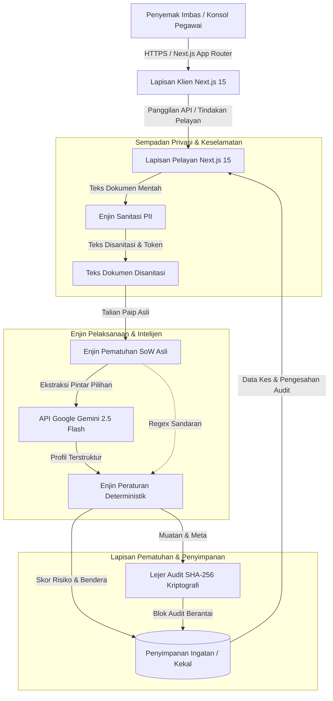
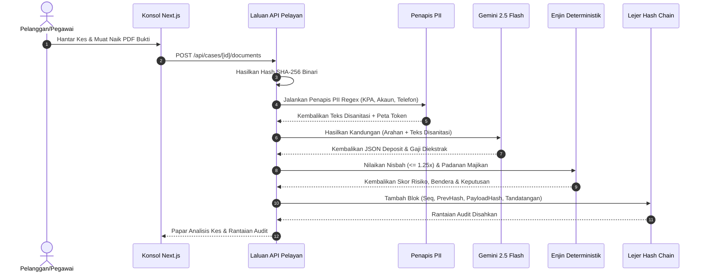
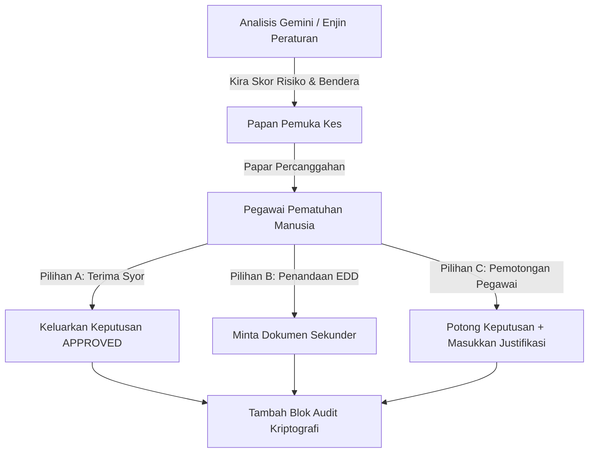
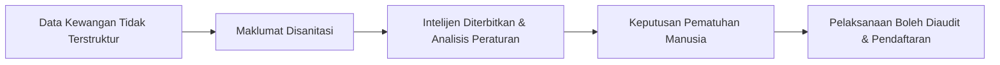

<p align="center">
  
</p>

# LUXERA PROVENANCE

### Infrastruktur Bukti Kewangan & Intelijen Pematuhan

**Infrastruktur pematuhan Sumber Kekayaan (Source of Wealth - SoW) sumber terbuka untuk syarikat teknologi kewangan (fintech), pengurus kekayaan Islam, institusi kewangan, dan operasi pematuhan.**

---

[](#-bahasa--language)
[](LICENSE)
[](https://nextjs.org)
[](https://www.typescriptlang.org)
[](https://ai.google.dev)
[](https://www.pdp.gov.my)
[]()

---

## 🌐 Bahasa / Language

- 🇬🇧 [**Dokumentasi Bahasa Inggeris (README.md)**](README.md)
- 🇲🇾 [**Dokumentasi Bahasa Melayu (README.ms.md)**](README.ms.md)

---

## 📋 Isi Kandungan

1. [Gambaran Keseluruhan Projek](#-gambaran-keseluruhan-projek)
2. [Falsafah Teras](#-falsafah-teras)
3. [Mengenai Luxera Cognitive Resources](#-mengenai-luxera-cognitive-resources)
4. [Kepimpinan & Pengasas](#-kepimpinan--pengasas)
5. [Mengapa Provenance Wujud](#-mengapa-provenance-wujud)
6. [Keupayaan Teras](#-keupayaan-teras)
7. [Aliran Kerja Hujung ke Hujung](#-aliran-kerja-hujung-ke-hujung)
8. [Seni Bina Sistem](#-seni-bina-sistem)
9. [Saluran Aliran Data](#-saluran-aliran-data)
10. [Lapisan Keputusan Deterministik lwn AI](#-lapisan-keputusan-deterministik-lwn-ai)
11. [Seni Bina Keselamatan](#-seni-bina-keselamatan)
12. [Privasi & Pematuhan Akta 709 (APDP)](#-privasi--pematuhan-akta-709-apdp)
13. [Seni Bina AI & Multimodal Gemini](#-seni-bina-ai--multimodal-gemini)
14. [Lejer Audit Berantai Kriptografi SHA-256](#-lejer-audit-berantai-kriptografi-sha-256)
15. [Enjin Semakan Manusia dalam Gelung (HITL)](#-enjin-semakan-manusia-dalam-gelung-hitl)
16. [Kumpulan Teknologi](#-kumpulan-teknologi)
17. [Struktur Projek](#-struktur-projek)
18. [Dokumentasi API](#-dokumentasi-api)
19. [Konfigurasi Persekitaran](#-konfigurasi-persekitaran)
20. [Pembangunan Tempatan & Pemasangan](#-pembangunan-tempatan--pemasangan)
21. [Sistem Reka Bentuk & Tipografi](#-sistem-reka-bentuk--tipografi)
22. [Ekosistem Produk](#-ekosistem-produk)
23. [Falsafah Intelijen Luxera](#-falsafah-intelijen-luxera)
24. [Peta Jalan Produk](#-peta-jalan-produk)
25. [Sumber Terbuka & Pelesenan](#-sumber-terbuka--pelesenan)
26. [Garis Panduan Sumbangan](#-garis-panduan-sumbangan)
27. [AI Bertanggungjawab & Pendedahan Keselamatan](#-ai-bertanggungjawab--pendedahan-keselamatan)
28. [Penafian Legal](#-penafian-legal)
29. [Hubungi Korporat](#-hubungi-korporat)

---

## 🏛️ Gambaran Keseluruhan Projek

**Luxera Provenance** ialah infrastruktur verifikasi bukti kewangan dan pematuhan Sumber Kekayaan (Source of Wealth - SoW) tahap enterprise bersumber terbuka. Direka khas untuk platform fintech, pengurus kekayaan Islam, bank digital, dan pasukan pematuhan kewangan, Provenance menukarkan bukti kewangan tidak terstruktur—seperti penyata bank, slip gaji, pengisytiharan cukai, geran/surat jual beli hartanah, dan surat pengesahan majikan—kepada intelijen pematuhan yang terstruktur dan sedia untuk diaudit.

### Sorotan Teknikal & Produk Utama
- **Enjin Penyenaraian PII Pra-LLM**: Penyamaran deterministik automatik untuk pengecam peribadi sensitif (No. KPA Malaysia, nombor pasport, nombor akaun bank/kad kredit, alamat e-mel, dan nombor telefon) sebelum data diproses oleh model AI, mematuhi Akta Perlindungan Data Peribadi 2010 (Akta 709 Seksyen 9).
- **Peraturan Ketekalan Kewangan Deterministik**: Pengesahan berasaskan peraturan yang menguatkuasakan ambang matematik—termasuk nisbah deposit 12 bulan kepada gaji tahunan (ambang $\le 1.25\times$), padanan kabur nama majikan, dan semakan kesegaran dokumen—menghalang keputusan AI yang terhalusinasi atau kabur.
- **Pengestrakan Dokumen & OCR Multimodal**: Pemprosesan dokumen sebelah pelayan dikuasakan oleh Google Gemini 2.5 Flash melalui `@google/genai` TypeScript SDK, digabungkan dengan enjin pematuhan asli yang bebas daripada sebarang kebergantungan luar.
- **Lejer Audit Berantai Hash Kriptografi SHA-256**: Lejer kalis usikan yang menghubungkan setiap penciptaan kes, penganjuran dokumen, penilaian peraturan, dan pemotongan keputusan pegawai pematuhan manusia ke dalam rantai hash yang boleh disahkan secara matematik.
- **Membuat Keputusan Manusia dalam Gelung (HITL)**: Konsol pegawai pematuhan khusus yang membolehkan semakan manual, penilaian mata risiko, justifikasi pemotongan keputusan, dan penjejakan kebenaran berkanun. AI membantu dan merumuskan penemuan; kuasa manusia membuat keputusan pematuhan muktamad.

---

## 💡 Falsafah Teras

Luxera Provenance dibina di atas enam prinsip operasi teras:

1. **Keutamaan Bukti**: Keputusan pematuhan mesti diterbitkan secara langsung daripada bukti utama yang disahkan, bukan andaian atau pengisytiharan kendiri yang tidak disahkan.
2. **Sempadan Deterministik**: Peraturan kewangan kritikal (seperti ambang varians dan had matematik) mesti dikuatkuasakan secara deterministik, bukan diwakilkan kepada model bahasa kebarangkalian.
3. **Privasi melalui Reka Bentuk**: Pengecam Data Peribadi (PII) mesti disanitasi sebelum penilaian model untuk mengelakkan kebocoran data dan memelihara kedaulatan subjek data di bawah undang-undang privasi tempatan.
4. **Kebolehredaan yang Boleh Disahkan**: Setiap tindakan pematuhan, transformasi data, dan pemotongan keputusan mesti menghasilkan rekod audit berantai kriptografi yang tidak boleh diubah.
5. **Kedaulatan Manusia**: Model AI berfungsi semata-mata sebagai pembantu kognitif kepada pegawai pematuhan. Kuasa perundangan dan akuntabiliti muktamad terletak sepenuhnya pada pegawai pematuhan manusia.
6. **Infrastruktur Intelijen**: Pematuhan bukan sekadar senarai semak pusat kos—ia adalah intelijen operasi yang membina kepercayaan institusi dan mempercepatkan kelajuan pendaftaran pelanggan.

---

## 🏢 Mengenai Luxera Cognitive Resources

**Luxera Cognitive Resources** ialah syarikat teknologi Malaysia yang memelopori **Infrastruktur Intelijen untuk Ekonomi Keputusan**. Luxera mereka bentuk dan menyebarkan platform perisian khusus yang mengubah aktiviti perniagaan yang terfragmentasi kepada kejelasan operasi, pembuatan keputusan automatik, dan pengalaman pelanggan yang lancar.

| Atribut | Perincian |
| :--- | :--- |
| **Nama Undang-Undang** | Luxera Cognitive Resources |
| **No. Pendaftaran** | 003808430-T |
| **Laman Web Korporat** | [https://www.luxera.world](https://www.luxera.world) |
| **Ibu Pejabat** | Kuala Selangor, Selangor, Malaysia |
| **E-mel Umum** | [contact@luxera.world](mailto:contact@luxera.world) |
| **Hubungi Perniagaan** | +60 17-734 8015 |
| **Penjajaran Teras** | *Infrastruktur Intelijen untuk Ekonomi Keputusan* |

---

## 👥 Kepimpinan & Pengasas

### Pengasas & Arkitek Sistem
**Khairulanuar Khaidir**  
*Pengasas & Arkitek Sistem, Luxera Cognitive Resources*

Khairulanuar mengetuai seni bina sistem, reka bentuk infrastruktur intelijen, dan kejuruteraan automatik AI di seluruh ekosistem produk Luxera. Fokus beliau merangkumi intelijen hasil, orkestrasi AI enterprise, sistem pematuhan deterministik, dan perisian perniagaan sedia produksi.
- **E-mel**: [khai@luxera.world](mailto:khai@luxera.world)
- **LinkedIn**: [https://www.linkedin.com/in/khairulanuar-khaidir](https://www.linkedin.com/in/khairulanuar-khaidir)

### Pengasas Bersama & Ahli Strategi Perniagaan
**Nur Adibah Tahir**  
*Pengasas Bersama & Ahli Strategi Perniagaan, Luxera Cognitive Resources*

Nur Adibah menyelia operasi komersial, perkongsian strategik industri, pembangunan pasaran, dan hubungan pelanggan institusi di seluruh operasi pematuhan domestik dan rantau.
- **E-mel**: [adibah@luxera.world](mailto:adibah@luxera.world)

---

## 🎯 Mengapa Provenance Wujud

Institusi kewangan dan pengurus kekayaan menghadapi geseran operasi yang teruk apabila mengesahkan Sumber Kekayaan (SoW) untuk Individu Bernilai Bersih Tinggi (HNWI) dan pelanggan pengurusan kekayaan runcit:

```
[Dokumen Terfragmentasi]    [Beban Kerja Manual]      [Risiko Pematuhan]
  - Penyata Bank              - Semakan Manual Baris    - Kebocoran PII
  - Slip Gaji & KWSP    --->  - Varians Tidak Dikesan -> - Audit Tidak Boleh Disah
  - Pengisytiharan Cukai      - Percanggahan Kertas     - Denda Pengawal Selia
  - Surat Jual Beli           - SLA Pelanggan Perlahan  - Peraturan Tidak Konsisten
```

1. **Bukti Tidak Terstruktur yang Terfragmentasi**: Bukti tiba dalam format PDF dan imej yang tidak konsisten, memerlukan semakan manual yang memakan masa oleh analisis pematuhan.
2. **Pendedahan PII dan Kedaulatan Data**: Menghantar dokumen kewangan pelanggan mentah secara terus kepada model AI awan mendedahkan pengecam peribadi sensitif, melanggar APDP 2010 (Akta 709) dan peraturan kerahsiaan perbankan tempatan.
3. **Ketiadaan Jejak Audit Tidak Boleh Diubah**: Proses semakan berasaskan helaian kerja atau tiket tradisional meninggalkan pasukan pematuhan terdedah semasa audit pengawal selia di bawah AMLA 2001 (Akta 613).
4. **Risiko AI Kotak Hitam**: Penyelesaian AI generik kekurangan sempadan peraturan deterministik, membawa kepada keputusan pematuhan yang tidak dapat diramalkan atau kelulusan palsu.

**Luxera Provenance menyelesaikan masalah ini dengan memperkenalkan saluran bukti yang terstruktur, memelihara privasi, dan deterministik yang disokong oleh integriti audit kriptografi.**

---

## ✨ Keupayaan Teras

- 📄 **Penganjuran Bukti Pelbagai Format Seret & Lepas**: Menyokong muat naik PDF dan imej sebelah klien dengan pengesahan jenis MIME serta-merta, had saiz, dan cap jari binari SHA-256 tempatan.
- 🔒 **Sanitasi PII Pra-LLM (Akta 709 APDP)**: Penyamaran corak regex masa nyata untuk No. KPA Malaysia (`YYMMDD-PB-###G`), nombor Pasport, nombor Akaun Bank/Kad Kredit (10–16 digit), alamat E-mel, dan nombor telefon Malaysia (`+601x`).
- 🤖 **Pengestrakan Penglihatan Gemini Multimodal**: Ekstrak profil kewangan terstruktur—termasuk gaji bersih bulanan, jumlah deposit 12 bulan, nama majikan, dan kod mata wang—menggunakan `@google/genai` TypeScript SDK dengan `gemini-2.5-flash`.
- ⚙️ **Enjin Ketekalan Kewangan Deterministik**: Pelaksanaan automatik peraturan pematuhan tegar:
  - Penilaian Nisbah Deposit kepada Gaji ($\le 1.25\times$ ambang).
  - Pengesahan Ketekalan Nama Majikan (Padanan kabur majikan diisytihar lwn diekstrak).
  - Skor Kesegaran & Kelengkapan Dokumen.
- 🔗 **Jejak Audit Berantai Hash Kriptografi SHA-256**: Setiap operasi kes menghasilkan blok audit berantai yang mengandungi `sequence_id`, `previous_block_hash`, `payload_hash`, cap masa, e-mel pelakon, dan `block_hash`. Termasuk pengesahan integriti matematik masa nyata.
- 🛡️ **Konsol Pegawai Manusia dalam Gelung (HITL)**: Antaramuka pengguna interaktif untuk pegawai pematuhan menyemak bendera risiko, memeriksa teks bukti disanitasi lwn mentah, memasukkan justifikasi pemotongan keputusan, dan mengeluarkan keputusan pematuhan mengikat (`APPROVED`, `MANUAL_REVIEW_REQUIRED`, `REJECTED`).
- 📑 **Enjin Permintaan Akses Subjek Data (DSAR)**: Penjanaan serta-merta dosier pematuhan JSON terstruktur yang mematuhi Seksyen 12 Akta 709 APDP.
- ⚡ **Enjin Pematuhan Asli**: Pelaksanaan enjin pematuhan asli sebelah pelayan dengan pengesahan deterministik automatik dan orkestrasi Gemini AI yang bebas sepenuhnya daripada sebarang pemasangan luaran.

---

## 🔄 Aliran Kerja Hujung ke Hujung

```
┌─────────────────────────────────────────────────────────────────────────┐
│                      ALIRAN KERJA KES PEMATUHAN                         │
└─────────────────────────────────────────────────────────────────────────┘
                                   │
                                   ▼
                       [ 1. Penciptaan Kes ]
           Butiran pelanggan, pendapatan & sumber diisytihar
                                   │
                                   ▼
                     [ 2. Kebenaran Berkanun ]
           Notis APDP Akta 709 & resit kebenaran direkodkan
                                   │
                                   ▼
                     [ 3. Muat Naik Bukti ]
            Penganjuran PDF / Imej & penghasilan hash SHA-256
                                   │
                                   ▼
                   [ 4. Sanitasi PII Pra-LLM ]
        Topengkan KPA, akaun, e-mel, telefon sebelum AI
                                   │
                                   ▼
                 [ 5. Pengestrakan OCR Gemini Vision ]
           Pengestrakan terstruktur deposit & gaji
                                   │
                                   ▼
               [ 6. Penilaian Peraturan Deterministik ]
        Semakan nisbah (<= 1.25x), padanan majikan, mata risiko
                                   │
                                   ▼
                 [ 7. Rantaian Blok Audit SHA-256 ]
         Blok ditambah dengan hash terdahulu & hash muatan
                                   │
                                   ▼
                 [ 8. Pegawai Pematuhan Manusia HITL ]
             Pegawai menyemak bendera & hantar keputusan muktamad
                                   │
                                   ▼
                   [ 9. Keputusan Kes Muktamad & DSAR ]
          Keadaan keputusan tidak boleh ubah & eksport dosier
```

---

## 📐 Seni Bina Sistem



---

## 🔀 Saluran Aliran Data



---

## ⚖️ Lapisan Keputusan Deterministik lwn AI

Luxera Provenance mengasingkan pengiraan deterministik daripada pemikiran AI secara ketat untuk memastikan kebolehramalan pematuhan:

| Lapisan Pemprosesan | Tanggungjawab | Jenis Lapisan | Jaminan Operasi |
| :--- | :--- | :--- | :--- |
| **Cap Jari Fail** | Mengira hash SHA-256 muat naik binari | **Deterministik** | $100\%$ kebolehulangan kriptografi |
| **Sanitasi PII** | Penyamaran corak regex KPA, Akaun Bank, E-mel | **Deterministik** | Sifar PII dihantar ke model AI |
| **OCR / Pengestrakan Dokumen** | Menganalisis teks & mengekstrak angka kewangan | **AI (Gemini Flash)** | Pemikiran multimodal dengan skor keyakinan |
| **Semakan Nisbah Pendapatan-Deposit** | Mengira $\frac{\text{Deposit Bank 12M}}{\text{Pendapatan Tahunan Diisytihar}}$ | **Deterministik** | Ambang matematik ketat ($\le 1.25\times$) |
| **Padanan Nama Majikan** | Padanan kabur majikan dokumen lwn diisytihar | **Deterministik** | Pengesahan padanan tepat atau sub-rentetan |
| **Tugasan Bendera Pematuhan** | Menugaskan mata risiko & pemulihan disyorkan | **Deterministik** | Peraturan skor risiko piawai (0–100) |
| **Sintesis Pematuhan** | Merumuskan penemuan & naratif risiko untuk pegawai | **AI (Gemini Flash)** | Ringkasan eksekutif bahasa semula jadi |
| **Keputusan Kes Muktamad** | Mengeluarkan keputusan mengikat (`APPROVED` / `REJECTED`) | **Manusia (HITL)** | Akuntabiliti pegawai pematuhan manusia |
| **Rantaian Blok Audit** | Menghubungkan acara keputusan ke dalam rantai hash | **Deterministik** | Bukti usikan kriptografi |

---

## 🛡️ Seni Bina Keselamatan

Luxera Provenance menguatkuasakan pelbagai kawalan keselamatan:

1. **Perlindungan Kunci API Sebelah Pelayan**: `GEMINI_API_KEY` diselenggara secara eksklusif dalam persekitaran sebelah pelayan (`process.env.GEMINI_API_KEY`). Ia tidak pernah didedahkan kepada bungkusan klien (`NEXT_PUBLIC_`).
2. **Pengesahan Kandungan Binari**: Dokumen yang dimuat naik disemak untuk integriti jenis MIME (`application/pdf`, `image/png`, `image/jpeg`), kekangan saiz (maksimum 10MB setiap dokumen), dan hash fail SHA-256.
3. **Penyamaran Data Pra-LLM**: Semua teks OCR melalui penapis penyamaran PII tempatan sebelum pembinaan muatan, menghapuskan risiko penyimpanan data model pihak ketiga.
4. **Rantaian Hash Kalis Usikan**: Acara audit terikat secara kriptografi kepada hash SHA-256 blok terdahulu. Sebarang pengubahsuaian pada muatan audit bersejarah membatalkan tandatangan rantaian.

---

## 📜 Privasi & Pematuhan Akta 709 (APDP)

Luxera Provenance direka bentuk untuk mematuhi **Akta Perlindungan Data Peribadi 2010 (Akta 709)** dan garis panduan pengawal selia berkaitan:

- **Seksyen 6 (Prinsip Am)**: Kebenaran berkanun direkodkan melalui lejer kebenaran khusus yang menjejaki ID pengguna, ID organisasi, tujuan, versi dasar, alamat IP klien, dan rentetan user-agent.
- **Seksyen 9 (Prinsip Keselamatan)**: Penyenaraian PII menopengkan pengecam data sensitif sebelum pemprosesan atau penghantaran luaran.
- **Seksyen 12 (Permintaan Akses Subjek Data - DSAR)**: Menyediakan titik akhir API automatik (`GET /api/compliance/dsar?case_id=...`) untuk mengeksport dosier pematuhan JSON terstruktur yang lengkap untuk subjek data atas permintaan.
- **Penjajaran Pemindahan Rentas Sempadan**: Dengan menjalankan sanitasi PII tempatan di sebelah pelayan sebelum penilaian model, risiko pemindahan data rentas sempadan dimitigasi mengikut peraturan PDP.

> *Nota: Kawalan perisian teknikal menyokong aliran kerja pematuhan APDP tetapi tidak membentuk pensijilan undang-undang bebas. Organisasi mesti memastikan pematuhan operasi secara keseluruhan.*

---

## 🤖 Seni Bina AI & Multimodal Gemini

Luxera Provenance menggunakan model **Google Gemini 2.5 Flash** melalui SDK TypeScript `@google/genai` rasmi (kelas `GoogleGenAI`) untuk pengestrakan dokumen sebelah pelayan dan sintesis naratif pematuhan.

### Langkah Pemprosesan AI:
1. **Analisis Dokumen Multimodal**: Menghantar teks OCR dokumen dan metadata ke dalam Gemini Flash.
2. **Pengestrakan Terstruktur**: Mengekstrak pendapatan bulanan disahkan, pendapatan tahunan disahkan, jumlah deposit bank 12 bulan, nama majikan dikesan, dan skor keyakinan pengestrakan.
3. **Penerangan Terstruktur**: Menyintesis naratif pematuhan 2–3 perenggan yang menyoroti sumber pendapatan, varians deposit, dan langkah EDD yang disyorkan.

```typescript
// Corak Laluan API Gemini Sebelah Pelayan
import { GoogleGenAI } from '@google/genai';

const ai = new GoogleGenAI({ apiKey: process.env.GEMINI_API_KEY });

const response = await ai.models.generateContent({
  model: 'gemini-2.5-flash',
  contents: prompt,
});
```

---

## 🔗 Lejer Audit Berantai Kriptografi SHA-256

Setiap acara dalam Luxera Provenance ditambah kepada **Lejer Audit Berantai Hash Kriptografi SHA-256** dalaman.

```mermaid
graph LR
    subgraph Blok Genesis
        B1[Blok #1<br/>Seq: 1<br/>PrevHash: GENESIS...<br/>Muatan: CASE_CREATED]
    end

    subgraph Blok Penilaian
        B2[Blok #2<br/>Seq: 2<br/>PrevHash: Hash(B1)<br/>Muatan: SOW_EVALUATED]
    end

    subgraph Blok Pegawai
        B3[Blok #3<br/>Seq: 3<br/>PrevHash: Hash(B2)<br/>Muatan: OFFICER_OVERRIDE]
    end

    B1 -->|Berangkai Hash| B2
    B2 -->|Berangkai Hash| B3
```

### Formula Hash Matematik
Untuk sebarang blok $N$:
$$\text{BlockHash}_N = \text{SHA256}\Big(\text{Seq}_N \;\parallel\; \text{PrevHash}_{N-1} \;\parallel\; \text{CaseID} \;\parallel\; \text{EventType} \;\parallel\; \text{ActorID} \;\parallel\; \text{Timestamp} \;\parallel\; \text{PayloadHash}_N\Big)$$

Sistem ini menyediakan titik akhir pengesahan automatik (`GET /api/compliance/verify-audit-chain`) yang mengira semula semua tandatangan blok secara berulang dan mengesahkan kesinambungan rantaian.

---

## 👤 Enjin Semakan Manusia dalam Gelung (HITL)

Model AI dalam Luxera Provenance tidak pernah melaksanakan keputusan mengikat secara autonomi tanpa pengawasan manusia.



Pegawai pematuhan boleh memeriksa teks dokumen mentah lwn disanitasi, menyemak kegagalan peraturan khusus, dan merekodkan sebab pemotongan keputusan ke dalam lejer audit berantai hash.

---

## 🛠️ Kumpulan Teknologi

| Komponen | Teknologi | Versi / Spesifikasi |
| :--- | :--- | :--- |
| **Rangka Kerja** | Next.js (App Router) | `15.4.9` |
| **Masa Jalankan UI** | React | `19.2.1` |
| **Bahasa Pengaturcaraan** | TypeScript | `5.9.3` |
| **Gaya** | Tailwind CSS | `4.1.11` |
| **Animasi** | Motion | `12.23.24` |
| **Ikon** | Lucide React | `0.553.0` |
| **SDK AI** | `@google/genai` | `^2.4.0` (Gemini 2.5 Flash) |
| **Enjin Aliran Kerja** | Enjin Pematuhan Asli | Pemrosesan Tempatan & Aturan Deterministik |
| **Kriptografi** | Node.js `crypto` | Pelaksanaan SHA-256 Asli |
| **Pembekuan (Container)** | Docker / Docker Compose | Persiapan Kontena Produksi |

---

## 📁 Struktur Projek

```
luxera-provenance/
├── .DOCS/                     # Bahan rujukan pematuhan berkanun & dokumen perundangan
├── app/                       # Direktori Next.js 15 App Router
│   ├── api/                   # Laluan API sebelah pelayan
│   │   ├── cases/             # Titik akhir pengurusan kes, muat naik & pemprosesan
│   │   ├── compliance/        # Titik akhir eksport DSAR & pengesahan rantaian audit
│   │   └── integrations/      # Titik akhir pemantau status perkhidmatan aktif
│   ├── cases/                 # Sub-laluan perincian kes (Gambaran, Bukti, Peraturan, Audit)
│   ├── compliance/            # Portal pematuhan berkanun & DSAR
│   ├── open-source/           # Pandangan dokumentasi seni bina sumber terbuka
│   ├── privacy/               # Dasar privasi & notis APDP
│   ├── layout.tsx             # Susun atur akar aplikasi
│   └── page.tsx               # Halaman utama & konsol utama
├── components/                # Komponen React yang boleh diguna semula
│   ├── Footer.tsx             # Kaki halaman korporat dengan butiran syarikat & pematuhan
│   ├── Navbar.tsx             # Navigasi utama & laci konsol
│   ├── console/               # Widget konsol pematuhan & jadual giliran
│   └── site/                  # Komponen persembahan halaman utama
├── docs/                      # Dokumentasi seni bina & pematuhan
│   ├── architecture/          # Kontrak & analisis aliran kerja n8n
│   ├── branding/              # Tipografi & spesifikasi jenama
│   └── compliance/            # Pemetaan kawalan undang-undang & matriks jurang
├── lib/                       # Logik perniagaan teras & perkhidmatan enjin
│   ├── audit/
│   │   └── hash-chain.ts      # Lejer rantaian hash kriptografi SHA-256
│   ├── compliance/
│   │   ├── ocr-engine.ts      # Pembungkus pengestrakan OCR dokumen
│   │   ├── pii-redactor.ts    # Penyamaran PII pra-LLM berasaskan regex
│   │   └── sow-engine.ts      # Peraturan deterministik & enjin AI Gemini
│   ├── db/
│   │   └── store.ts           # Penyimpanan pematuhan ingatan kekal & benih lalai
├── public/                    # Direktori penjenamaan & aset statik
│   ├── main-logo.png          # Tanda logo utama Luxera
│   └── provenance-logo.png    # Logo penjenamaan produk Luxera Provenance
├── .env.example               # Templat konfigurasi pemboleh ubah persekitaran
├── Dockerfile                 # Konfigurasi Docker produksi
├── docker-compose.yml         # Manifesto orkestrasi kontena
├── LICENSE                    # Lesen Apache 2.0
├── package.json               # Kebergantungan Node.js & skrip
└── tsconfig.json              # Konfigurasi TypeScript
```

---

## 🔌 Dokumentasi API

### 1. Cipta Kes Sumber Kekayaan (SoW)
- **Titik Akhir**: `POST /api/cases`
- **Badan Permintaan**:
  ```json
  {
    "customer_name": "Ahmad Zaki Bin Osman",
    "customer_nric_passport": "880312-14-5591",
    "declared_annual_income": 180000,
    "currency": "MYR",
    "primary_source_category": "EMPLOYMENT",
    "employer_name": "Malayan Tech Innovations Sdn Bhd",
    "occupation_title": "Senior Solutions Architect"
  }
  ```
- **Respons**: `201 Created` dengan rekod `SoWCase` penuh dan blok audit awal `CASE_CREATED`.

### 2. Muat Naik Dokumen Bukti Sokongan
- **Titik Akhir**: `POST /api/cases/[id]/documents`
- **Jenis Kandungan**: `multipart/form-data`
- **Medan Borang**: `file` (Objek fail), `file_type` (`PAYSLIP` | `BANK_STATEMENT` | `TAX_DECLARATION` | `LEGAL_DEED` | `OTHER`)
- **Respons**: `200 OK` dengan hash SHA-256 binari dan hasil teks disanitasi pra-LLM.

### 3. Jalankan Penilaian Sumber Kekayaan
- **Titik Akhir**: `POST /api/cases/[id]/process`
- **Badan Permintaan**:
  ```json
  {
    "options": {
      "enablePiiRedaction": true,
      "preferN8NIfConfigured": true
    }
  }
  ```
- **Respons**: Mengembalikan `SoWEvaluationResult` mengandungi skor risiko, hasil peraturan, bendera pematuhan, dan penerangan AI.

### 4. Pemotongan Keputusan Pegawai Pematuhan Manusia
- **Titik Akhir**: `POST /api/cases/[id]/override`
- **Badan Permintaan**:
  ```json
  {
    "decision": "APPROVED",
    "review_notes": "Surat pengesahan pekerjaan sekunder disahkan oleh HR.",
    "officer_id": "USR-OFFICER-01"
  }
  ```
- **Respons**: Menambah blok audit `OFFICER_OVERRIDE` dan mengemas kini status kes.

### 5. Sahkan Rantaian Audit Kriptografi
- **Titik Akhir**: `GET /api/compliance/verify-audit-chain`
- **Respons**:
  ```json
  {
    "isValid": true,
    "totalBlocks": 3,
    "brokenIndex": null,
    "message": "All 3 audit blocks verified successfully."
  }
  ```

---

## ⚙️ Konfigurasi Persekitaran

Rujuk `.env.example` untuk mengkonfigurasi kunci persekitaran:

```env
# Kunci API Google Gemini AI Sebelah Pelayan (Diperlukan untuk penilaian AI asli & pengestrakan OCR)
GEMINI_API_KEY=your_gemini_api_key_here
```

> 💡 **Nota Seni Bina Kendiri (Self-Contained)**: Spesifikasi aliran kerja n8n asal Wahed SoW dikekalkan di dalam `.DOCS/JSON/` semata-mata sebagai rujukan dan spesifikasi sumber. Luxera Provenance melaksanakan keseluruhan talian paip (pipeline) ini secara asli (native) dalam kod aplikasi, menghapuskan keperluan masa jalanan n8n.

---

## 💻 Pembangunan Tempatan & Pemasangan

### Prasyarat
- **Node.js**: v20.x atau lebih tinggi
- **npm**: v10.x atau lebih tinggi (atau Bun / pnpm)
- **Docker**: (Pilihan) Docker & Docker Compose untuk persiapan berkontena

### Langkah Pemasangan Tempatan

1. **Klon Repositori**:
   ```bash
   git clone https://github.com/luxera-provenance/luxera-provenance.git
   cd luxera-provenance
   ```

2. **Pasang Kebergantungan**:
   ```bash
   npm install
   ```

3. **Konfigurasikan Pemboleh Ubah Persekitaran**:
   ```bash
   cp .env.example .env.local
   # Sunting .env.local dan masukkan GEMINI_API_KEY
   ```

4. **Jalankan Pelayan Pembangunan**:
   ```bash
   npm run dev
   ```
   Buka [http://localhost:3000](http://localhost:3000) dalam penyemak imbas anda.

5. **Semakan Jenis & Linting**:
   ```bash
   npm run lint
   ```

6. **Binaan Produksi**:
   ```bash
   npm run build
   npm run start
   ```

### Menjalankan dengan Docker Compose

```bash
docker-compose up -d --build
```

---

## 🎨 Sistem Reka Bentuk & Tipografi

Luxera Provenance menggunakan bahasa reka bentuk **Estetik Kewangan Institusi** yang direka khas untuk mengelakkan klise visual AI pengguna biasa:

- **Palet Warna**: Kanvas Slate Gelap (`#0b0f17`), Permukaan Panel (`#0f172a`), Sempadan Slate Halus (`#1e293b`), Penegasan Risiko Amber (`#fbbf24`), Penegasan Kelulusan Zamrud (`#34d399`), dan Teks Malap (`#94a3b8`).
- **Tipografi**: Menggunakan muka taip paparan premium **Switzer** (terletak di `/public/Switzer_Complete/Fonts`), digabungkan dengan susunan fon sistem sans-serif dan monoruang yang bersih untuk jadual data berangka.

---

## 🌐 Ekosistem Produk

Luxera Provenance beroperasi sebagai tonggak bukti kewangan dan intelijen pematuhan khusus dalam keluarga produk **Luxera Cognitive Resources** yang lebih luas:

- **Luxera Provenance**: Bukti kewangan, pematuhan Sumber Kekayaan, sanitasi PII, dan infrastruktur audit SHA-256.
- **Luxera Outreach Intelligence Platform**: Intelijen hasil B2B, penemuan bakal pelanggan dikuasakan AI, dan automasi kempen jualan.
- **Kalman Lumiere / Ownsify**: Sistem keputusan dan pengoptimuman sumber proprietari yang dibangunkan di bawah ekosistem Luxera.

---

## 🧠 Falsafah Intelijen Luxera

Luxera memandang intelijen bukan sebagai slogan pemasaran, tetapi sebagai **infrastruktur operasi**:



Dengan menukarkan dokumen mentah yang bising kepada intelijen terstruktur, organisasi mencapai kelajuan pematuhan yang lebih pantas sambil mengekalkan sempadan risiko yang ketat.

---

## 🗺️ Peta Jalan Produk

### Versi Semasa (`v0.1.0` - Dikeluarkan)
- [x] Enjin Sanitasi PII Pra-LLM untuk No. KPA Malaysia, Akaun, E-mel & Telefon.
- [x] Peraturan Nisbah Deposit kepada Gaji & Padanan Majikan Deterministik.
- [x] Pengestrakan Dokumen Multimodal Gemini 2.5 Flash Sebelah Pelayan.
- [x] Lejer Audit Berantai Hash Kriptografi SHA-256 dengan API pengesahan langsung.
- [x] Konsol Pemotongan Keputusan Pegawai Manusia dalam Gelung.
- [x] Integrasi Webhook Aliran Kerja n8n Live & Kejatuhan Automatik.

### Fasa Seterusnya (`v0.2.0` - Dalam Pembangunan)
- [ ] Penyesuai pangkalan data kekal PostgreSQL / Supabase melalui Drizzle ORM.
- [ ] Analisis penyata KWSP (Kumpulan Wang Simpanan Pekerja) automatik.
- [ ] RBAC (Kawalan Capaian Berasaskan Peranan) Organisasi Pelbagai Penyewa.

### Sasaran Masa Depan (`v1.0.0` - Sasaran Reka Bentuk)
- [ ] Sambungan verifikasi bukti Zero-Knowledge Proof (ZKP).
- [ ] Integrasi padanan senarai sekatan rentas sempadan (PBB, OFAC, MHA).

---

## 📄 Sumber Terbuka & Pelesenan

Luxera Provenance ialah perisian bersumber terbuka yang dilesenkan di bawah **[Lesen Apache 2.0](LICENSE)**.

```
Hak Cipta 2026 Luxera Cognitive Resources

Dilesenkan di bawah Lesen Apache, Versi 2.0 ("Lesen");
anda tidak boleh menggunakan fail ini melainkan mematuhi Lesen.
Anda boleh mendapatkan salinan Lesen di

    http://www.apache.org/licenses/LICENSE-2.0

Melainkan diperlukan oleh undang-undang yang terpakai atau dipersetujui secara bertulis, perisian
yang diedarkan di bawah Lesen diedarkan atas dasar "SEPERTI ADA",
TANPA SEBARANG WARANTI ATAU SYARAT, sama ada tersurat atau tersirat.
Lihat Lesen untuk bahasa khusus yang mengawal kebenaran dan
had di bawah Lesen.
```

*Nota: Lesen sumber terbuka terpakai untuk kod sumber. Tanda jenama, nama produk, logo, dan identiti korporat Luxera Cognitive Resources kekal tertakluk kepada garis panduan cap dagangan.*

---

## 🤝 Garis Panduan Sumbangan

Kami mengalu-alukan sumbangan komuniti untuk menambah baik pengestrakan bukti, menambah peraturan pematuhan khusus bidang kuasa, dan meluaskan penapis regex PII.

1. **Klon Repositori (Fork)**.
2. **Cipta Cawangan Ciri**: `git checkout -b feature/peraturan-pematuhan-baru`.
3. **Komit Perubahan Anda**: Ikuti mesej komit yang jelas (`git commit -m 'feat: tambah peraturan penyata KWSP'`).
4. **Jalankan Pengesahan**: Pastikan `npm run lint` dan `npm run build` lulus tanpa ralat.
5. **Buka Permintaan Tarik (Pull Request)**: Sediakan perincian perubahan dan rasional pematuhan.

Rujuk [CONTRIBUTING.md](CONTRIBUTING.md) untuk perincian penuh.

---

## 🔐 AI Bertanggungjawab & Pendedahan Keselamatan

### Prinsip AI Bertanggungjawab
- **Kejelasjelasan**: Setiap penilaian AI mesti menyediakan pemikiran terstruktur dan merujuk bukti yang diekstrak.
- **Minimisasi Data**: PII ditopengkan sebelum penyerahan model.
- **Keputusan Non-Autonomi**: Model AI tidak boleh melaksanakan penolakan atau kelulusan kes mengikat muktamad tanpa pengawasan pegawai pematuhan manusia.

### Pelaporan Kerentanan Keselamatan
Jika anda menemui kerentanan keselamatan atau ralat pengendalian data, sila **JANGAN** buka isu GitHub awam. Hantar laporan terperinci secara terus kepada:

📧 **Hubungi Keselamatan**: [contact@luxera.world](mailto:contact@luxera.world)

---

## ⚠️ Penafian Legal

**Luxera Provenance** ialah infrastruktur perisian yang direka untuk membantu profesional pematuhan kewangan dalam menyusun dan menganalisis bukti Sumber Kekayaan. Penggunaan Luxera Provenance **tidak** membentuk nasihat undang-undang, kewangan, cukai, atau pengawal selia rasmi, dan tidak menjamin pensijilan pematuhan di bawah undang-undang AML/CFT tempatan. Penentuan pematuhan muktamad kekal sebagai tanggungjawab tunggal institusi kewangan yang beroperasi.

---

## 📞 Hubungi Korporat

**Luxera Cognitive Resources**  
*No. Pendaftaran 003808430-T*

- 🌐 **Laman Web Korporat**: [https://www.luxera.world](https://www.luxera.world)
- 📧 **Pertanyaan Umum**: [contact@luxera.world](mailto:contact@luxera.world)
- 📞 **Hubungi Perniagaan**: +60 17-734 8015
- 📍 **Lokasi**: Kuala Selangor, Selangor, Malaysia
- 📸 **Instagram**: [https://www.instagram.com/luxeraworld/](https://www.instagram.com/luxeraworld/)
- 📘 **Facebook**: [https://www.facebook.com/luxeraworld/](https://www.facebook.com/luxeraworld/)
- 💼 **LinkedIn**: [Khairulanuar Khaidir](https://www.linkedin.com/in/khairulanuar-khaidir)

---

<p align="center">
  <sub>Dibina dengan ketepatan oleh <b>Luxera Cognitive Resources</b> • Kuala Selangor, Malaysia</sub>
</p>
