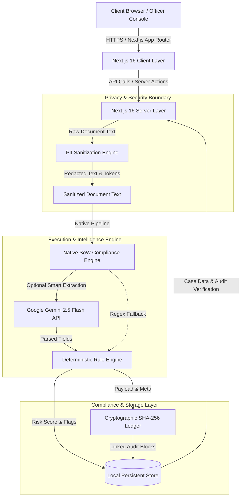

# Luxera Provenance — System Architecture

This document provides a detailed technical overview of the architecture, component interaction, security boundaries, and data processing model for **Luxera Provenance**.

---

## 1. High-Level Architecture Diagram

---

## 2. Component Subsystems

### 2.1 Next.js 16 Full-Stack Core
- **App Router (`app/`)**: Handles UI routing, server rendering, client interactive state, and API routes.
- **Server API Routes (`app/api/`)**: Enforces server-side execution for document handling, PII redaction, AI processing, officer decision overrides, and DSAR export.

### 2.2 Pre-LLM PII Sanitization Subsystem (`lib/compliance/pii-redactor.ts`)
- Evaluates document OCR text against regex filters prior to constructing model prompts.
- Replaces Malaysian NRIC, Passport numbers, Bank Account/Credit Card numbers, Email addresses, and Phone numbers with tokenized tags (`[NRIC_REDACTED_1]`, `[ACCT_REDACTED_1]`, etc.).
- Preserves token mapping locally for authorized officer inspection while ensuring zero unmasked PII reaches cloud LLM providers.

### 2.3 Native SoW Compliance Engine (`lib/compliance/sow-engine.ts`)
- **Primary Server-Side Engine**: Native `@google/genai` SDK implementation targeting `gemini-2.5-flash`. Executes structured extraction and compliance narrative synthesis.
- **Deterministic Regex Fallback**: Employs highly accurate local regex expressions to parse financial data from document OCR text offline if Gemini is not configured, guaranteeing full operational continuity.

### 2.4 Deterministic Financial Rules Subsystem
- Executes mathematical validations independently of probabilistic LLM output:
  - **Deposit-to-Salary Ratio**: Checks whether 12-month bank deposits exceed annual declared salary by over $25\%$ ($\text{Ratio} > 1.25$).
  - **Employer Fuzzy Match**: Verifies matching between declared employer name and extracted employer name from payslips/tax forms.
  - **Risk Point Calculation**: Assigns standard risk points (0–100) and maps cases to risk categories (`LOW`, `MEDIUM`, `HIGH`, `CRITICAL`).

### 2.5 Cryptographic SHA-256 Audit Ledger (`lib/audit/hash-chain.ts`)
- Maintains an immutable sequence of audit blocks.
- Each block contains:
  - `sequence_id`
  - `previous_block_hash`
  - `case_id` & `organization_id`
  - `event_type` & `actor_id` / `actor_email`
  - `timestamp`
  - `payload_hash`
  - `block_hash`
- Includes continuous integrity verification logic (`verifyAuditChainIntegrity`).

---

## 3. Data Storage & Persistence Model (`lib/db/store.ts`)
- Currently utilizes a persistent local compliance store seeded with realistic default compliance cases, documents, and audit trails.
- Designed for seamless adaptation to PostgreSQL / Supabase adapters via ORM layers.
